# BigData_FinalProject_Group12
# Team Members
* Aasish Chunduri
* Sumanth Reddy Alluri
* Siva Naga Rutwik Reddy Chintha
* Varshith Reddy Gopu
* Aditya Shiva Sai Agganoor
# Communication Plan
We are communicating with the teammates through email, slack and decided to connect every weekend through zoom calls.
# Business Problem or Opportunity:
The dataset under consideration here is from the CDC's yearly poll of individuals regarding their health status. The dataset originated from the CDC and is a significant component of the Behavioural Risk Factor Surveillance System (BRFSS), which conducts annual telephone surveys to collect information on Americans' health conditions. Heart disease, one of the major causes of death for people of most races in the US, is caused by high blood pressure, high cholesterol, and smoking, according to the CDC (Centers for Disease Control and Prevention). Other significant indicators are the presence of diabetes, obesity (high BMI), a lack of physical activity, and excessive alcohol consumption. Data from 2020 is included in the most recent dataset (as of February 15, 2022). The dataset we selected will undergo data pre-processing so that we can apply a spectrum of machine learning models to derive and identify "patterns" from the data that can predict a patient's condition because identifying and preventing the factors that have the greatest impact on heart disease is very important in healthcare.

Link: https://www.kaggle.com/datasets/kamilpytlak/personal-key-indicators-of-heart-disease
# Research Objectives:
We pre-process the dataset and use the data to make predictions and derive insights. Using multiple factors like high blood pressure, high cholesterol, smoking, and BMI we can train a machine learning model on this dataset to predict a person's risk of developing heart disease considering the various factors present in the dataset. 
* What habits increase the risk of getting heart disease ?
* Using the various variables(habits) to predict a person's risk of developing heart diseas

# Deliverable 2
## Data Understanding
We have one csv file named heartdisease.csv where HeartDisease column is the dependent variable and remaining columns are the independent variables. We have 319795 entries and 18 columns. 

We performed the exploratory data analysis on our dataset.

## Exploratory Data Analysis:
We used AWS QuickSight for the exploratory data analysis.

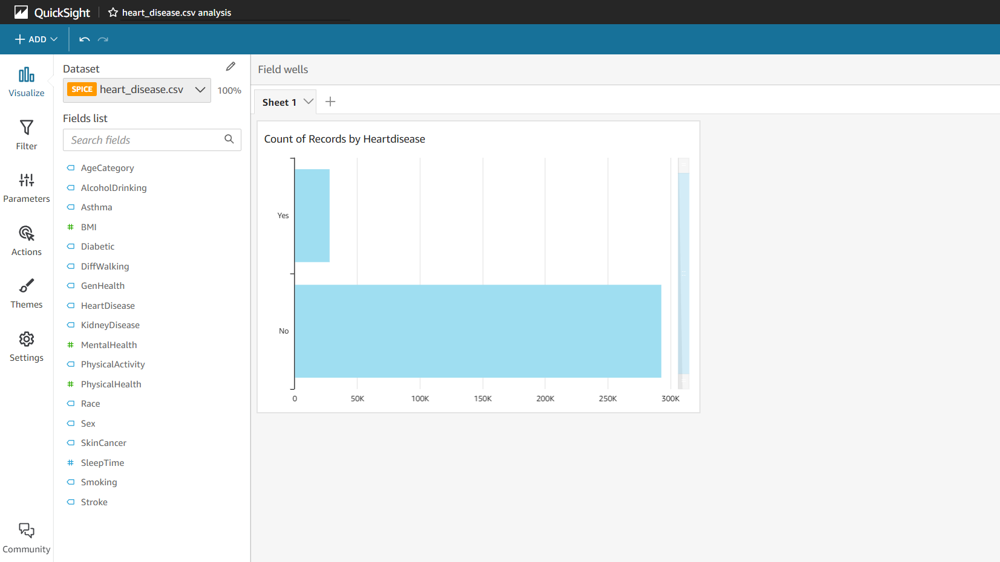
The above visualization represents the number of people having heart disease and those of not have it. 

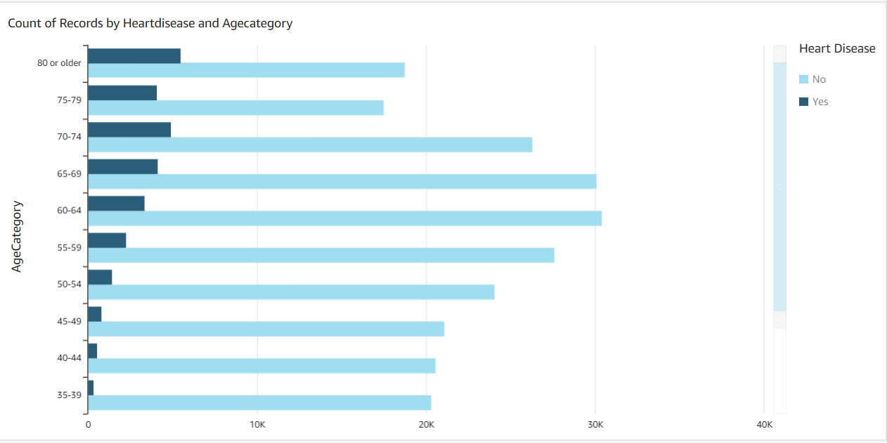
The above visualization represents the relation between age category and heart disease. It gives an analysis of how many people belonging to a particular age have
been exposed to heart disease or not. 

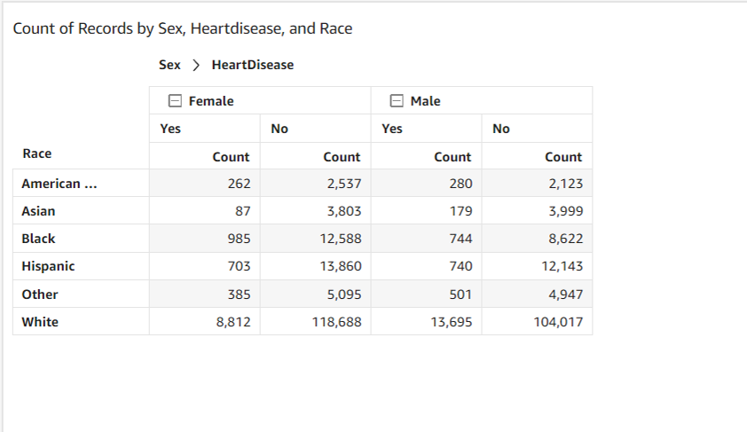
The above visualization is for Sex,Race against heart disease. It gives us an analysis of which race people and gender people are more effected by heart disease. 

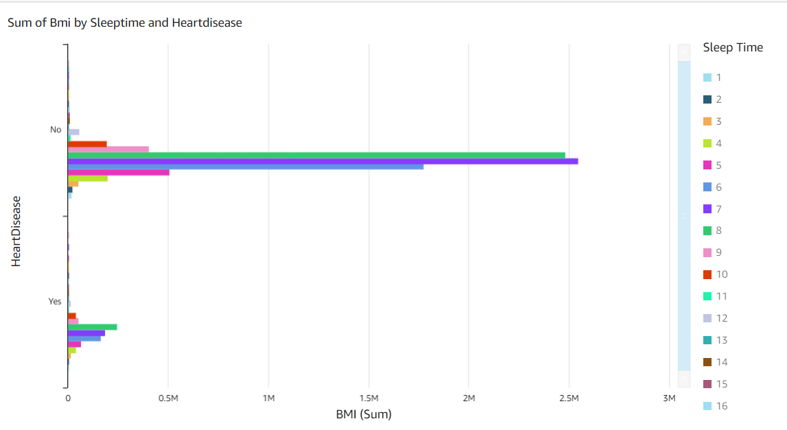
The above chart explains the relationship between BMI, sleep time, and heart disease. 

## Data Preparation
We used Sagemaker for the data preparation and the data cleaning process. We have imported the necessary libraries to perform these actions.
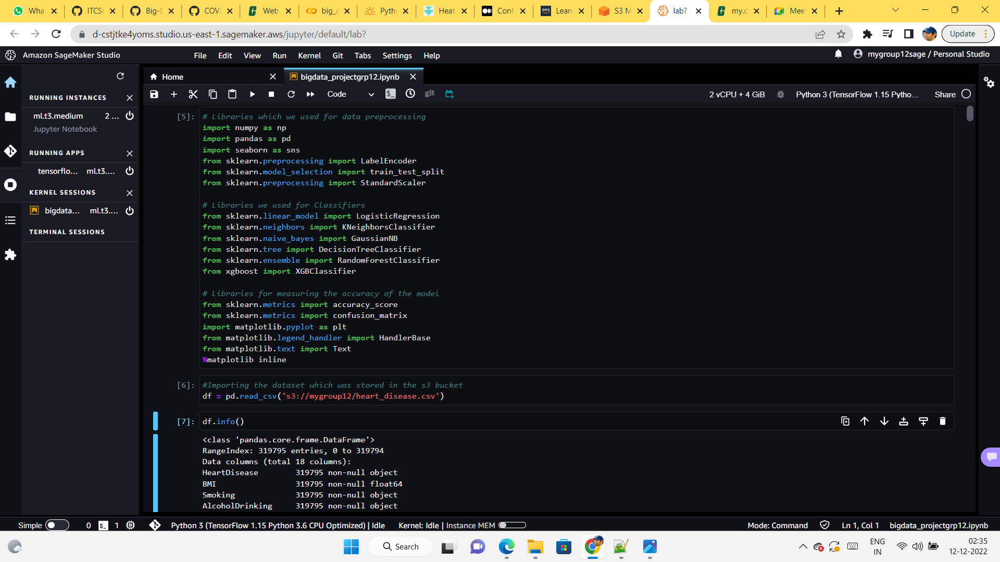 
There are no missing values in the dataset in any column.
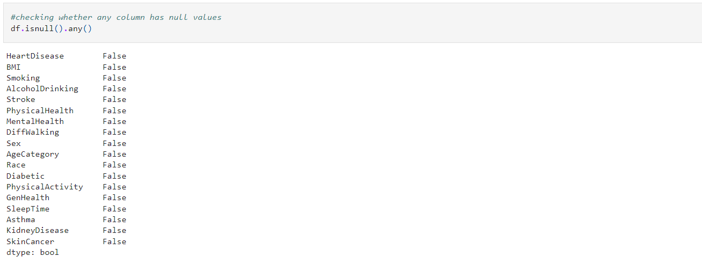 
We have multiple categorical values in each column. We need to convert all of them into numerical values to train the model.
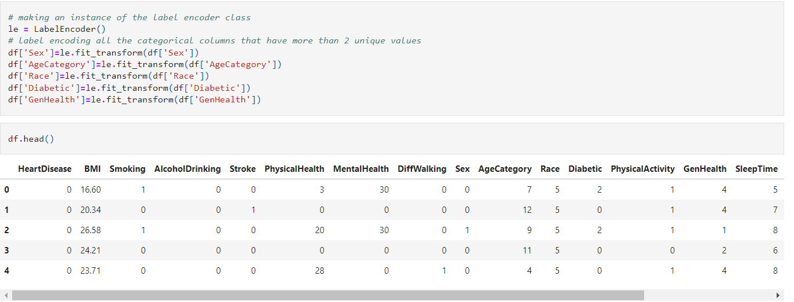  
These are the steps taken in the Data preparation phase which makes the data ready to train using the machine learning model.

# Deliverable 3
## Analytics,Machine learning
We have used different AWS services for this deliverable such as
* Amazon S3
* Amazon Glue
* Amazon Athena
* Amazon SageMaker
  
We have uploaded our dataset in the Amazon S3 and perfomed operations on the dataset using the S3 url of the dataset using different AWS services. 
We have used Amazon Athena and Amazon Glue to query the data in the Amazon S3. 
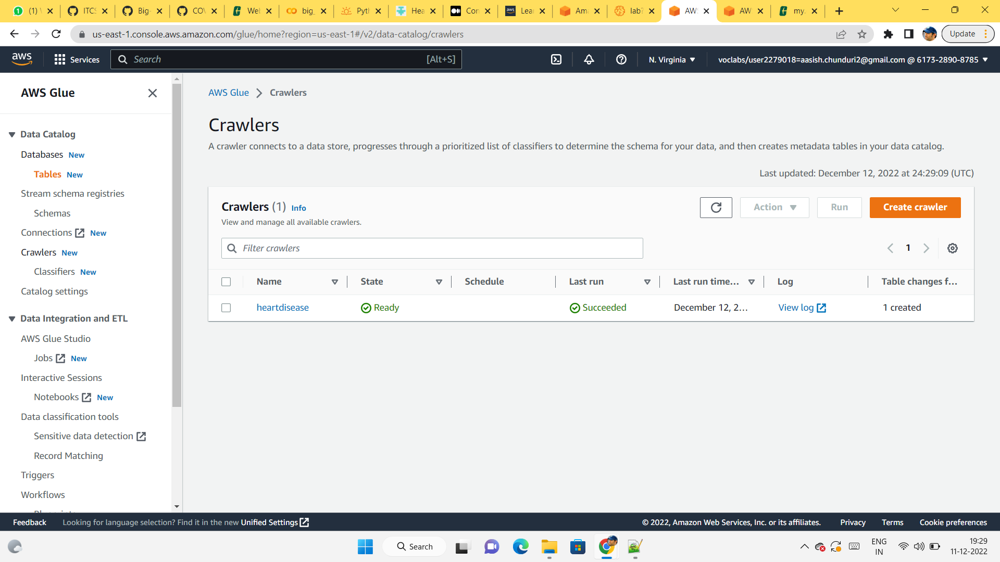 
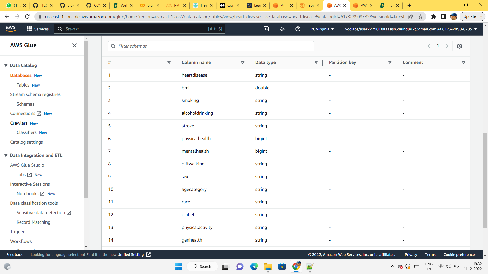 
Here we can view the schema of the dataset using Amazon Glue. We can use the crawler with Glue to get the schema of the dataset.
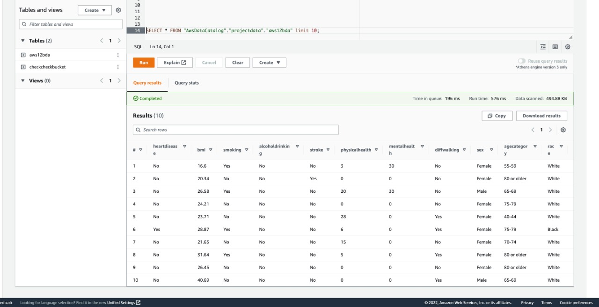 
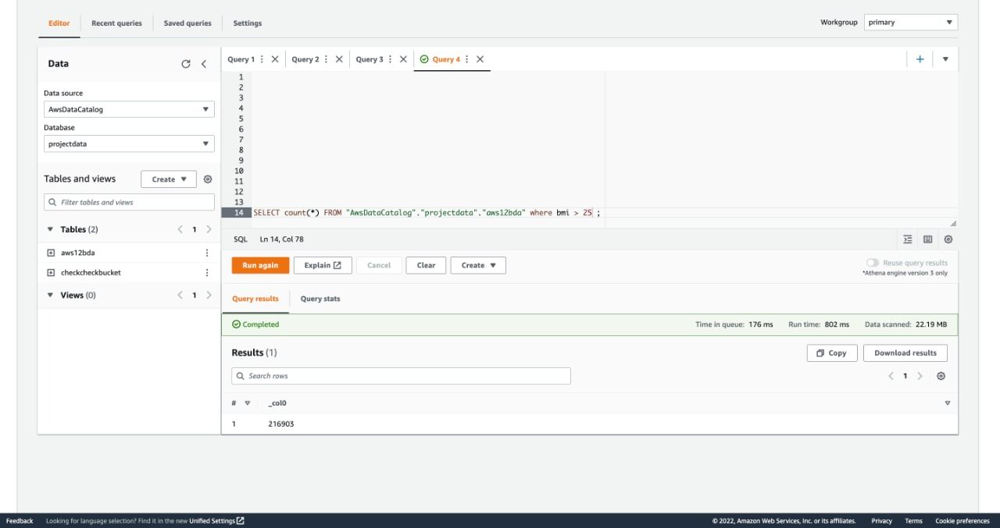  
We ran queries using the Amazon Athena.

* For the Heart Disease prediction, we have used multiple machine learning models to compare and check the accuracy and consider the model with the best accuracy percentage. We have found that Logistic Regression and XGBoost algorithm turns out to be the best models with more accuracy percentage between the train data and the test data. We had split the data in 70:30 ratio where 70% of the data is used for training the model and the remaining 30% is used to test the model.
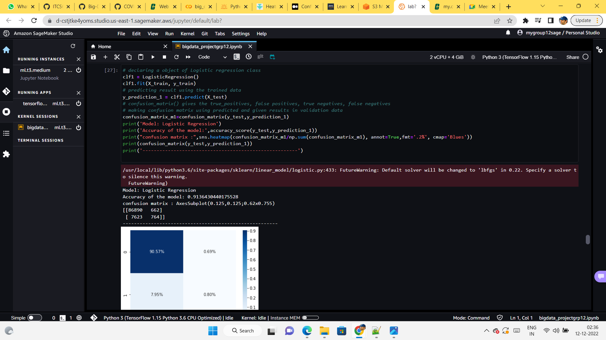  
* Logistic regression is a type of statistical model that is used for binary classification tasks, where the goal is to predict the probability that an example belongs to one of two classes. It is a type of regression model because it is used to make predictions about a continuous outcome (the probability that an example belongs to a particular class), but it uses a logistic function to constrain the predicted probabilities to lie between 0 and 1. This makes it different from other regression models, which can predict any value within the range of the dependent variable.  
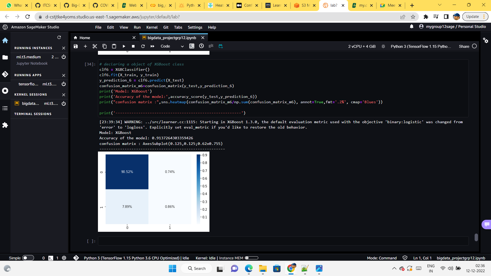 
* XGBoost works by creating a large number of decision trees, each of which is trained to make predictions for a subset of the training data. The predictions made by each tree are then combined to make a final prediction, using a technique called gradient boosting. This allows XGBoost to make highly accurate predictions while also being computationally efficient.
## Evaluation and Optimization
We have used several machine learning algorithms to build the models such as Logistic Regression, KNeighborsClassifier, Naive bayes, Decision tree, Random forest, and XGBoost algorithms to build the models. Out of these different models XGboost algorithms performs better with the better accuracy percentage whereas the Naive Bayes algorithm performed poorly with the given data with least accuracy rate among the models which we used. The accuracy score of the XGBoost algorithm is 91.37% whereas for the Naive Bayes it is 84.61%.

# Results

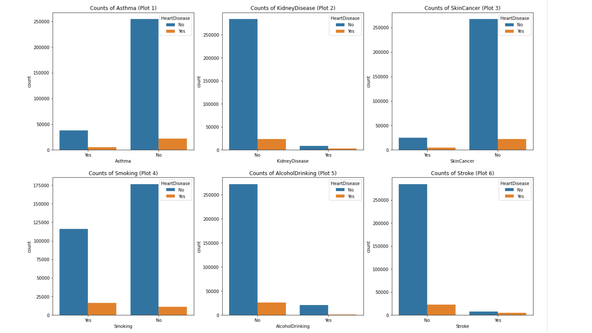
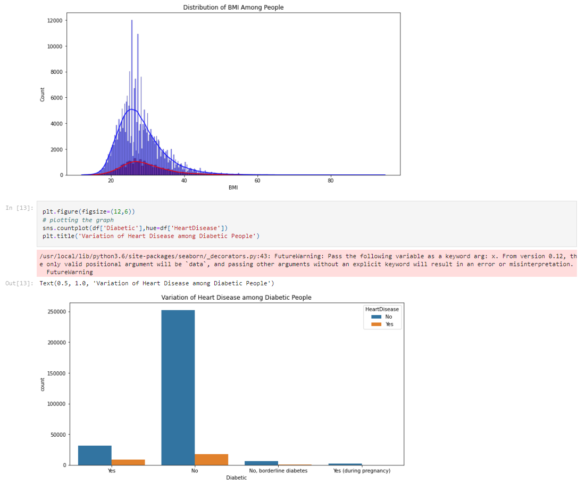
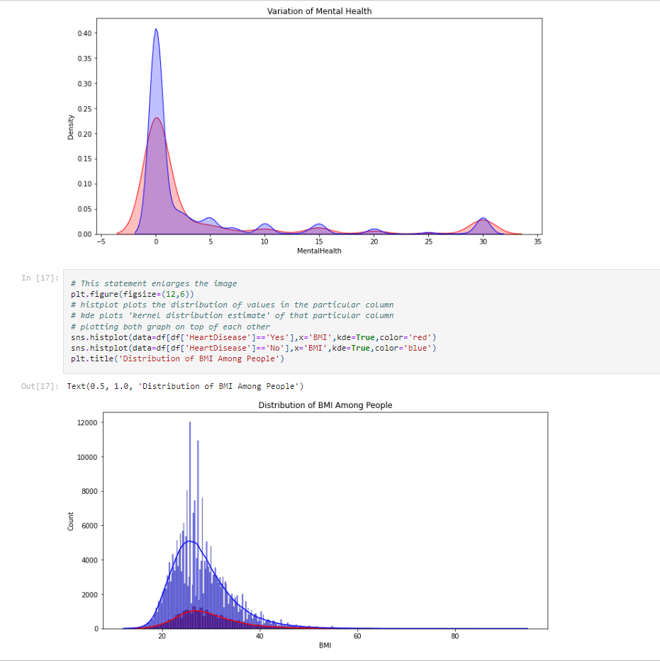

Below is the table representing the accuracy scores of the different models.

| Model                 | Accuracy| 
| -----------------     | --------| 
| Logistic Regression   | 0.91364 | 
| KNeighborsClassifier  | 0.90480 |
| GaussianNB            | 0.84618 |
| DecisionTreeClassifier| 0.86495 |
| RandomForestClassifier| 0.90401 |
| XGBClassifier         | 0.913726 |

# Future Work, Comments
### What was unique about the data?  Did you have to deal with imbalance? What data cleaning did you do? Outlier treatment?  Imputation?
The uniqueness of the dataset is about having different kinds of lifestyle habits which directly or indirectly effect the risk of attacking the heart disease for a person, few such habits are sleeptime, kidney disease, and physical activity. 
The dataset which we chose is clean so we did not have to deal with the imbalance and perform the outlier treatment for the dataset. 
Data preprocessing and cleaning steps which we carried out on our dataset is changing the categorical variables into the numerical so that we can be able to train the model to make the predictions.
### Did you create any new additional features / variables?
The dataset contains all the necessary variables to determine whether a person can get the heart disease or not, so we haven't created new feautures or the variables to the exisiting dataset.
### What was the process you used for evaluation?  What was the best result?
We have used 6 different machine learning models/algorithms and found out XGBClassifier is the best model among all other models with best accuracy percentage.
### What were the problems you faced? How did you solve them?
As we have choosen the dataset from the kaggle instead of AWS registry we faced some difficulties in setting up the dataset in the AWS and working with the dataset by setting up all the acccesses to work upon. Later we faced some issues with Amazon Athena in querying our data from Amazon S3 and later we resolved the issue and got to run our queries efficiently. There were some challenges in setting up the notebook in the Amazon Sagemaker and running the differnt libraries which did not came as preinstalled so we had to install those libraries before working on the dataset and building the machine learning models.
### What future work would you like to do?
We can build an application to ask the user input about their habits and provides an insights and recommendations what needs to be done form their end to be healthy and risk free from the heart related diseases and also can study in depth which variable is effecting the most in causing the heart related diseases and can intimate the people about those potential habits which needs to be avoided.
# Video Presentation

